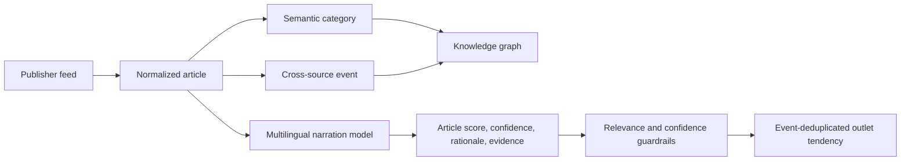

# News knowledge and narration intelligence

Status: multilingual ML v3 with durable article workflows, August 2026

## Product story

A newsroom receives several accounts of the same real-world event. The system therefore keeps article, event, category, publisher, and narration as separate concepts:

1. A publisher produces an article.
2. The article is normalized and assigned a semantic category.
3. Similar reports are clustered into one event.
4. Events become nodes in the knowledge graph and timeline.
5. A multilingual model evaluates how each article narrates economic policy.
6. Only repeated, confident, relevant results contribute to an outlet tendency.

Reporting about a left-wing party is not automatically left-wing reporting. Party identity is not an input to the narration score. An article can criticize a left-wing party using left-economic arguments, support a right-wing party using state-led arguments, or mention either party without expressing any economic framing.



## Knowledge-page interaction

The event map fills the content container. Category nodes sit on the left, event nodes occupy the timeline, and publisher nodes sit on the right. Users can:

- pan the graph by dragging empty canvas space;
- zoom around the pointer without scrolling the page;
- use accessible zoom-in, zoom-out, and reset controls;
- select an event with a pointer or keyboard;
- inspect its reports in a Shadcn scroll area that supports wheel, trackpad, scrollbar, and drag scrolling;
- filter the server-rendered graph using preset or custom date ranges and category URL parameters.

## Two different political views

The UI deliberately shows two related but independent views.

### Curated party-policy reference

The party map is a human-reviewed reference on one named axis:

> Economic policy: state-led (-1) to market-led (+1)

It is not a moral rating, a truth score, or the source of an article score. Each placement has a confidence, rationale, and evidence links so an editor can challenge and revise it.

| Party | Position | Display band | Initial rationale | Confidence |
| --- | ---: | --- | --- | ---: |
| Frontline Socialist Party (FSP) | -0.95 | Far left | Explicit Marxist orientation | 0.82 |
| Janatha Vimukthi Peramuna (JVP) | -0.90 | Far left | Marxist-Leninist roots and socialist programme | 0.92 |
| National People's Power (NPP) | -0.40 | Center-left | Equity and social protection combined with a mixed economy | 0.78 |
| Sri Lanka Freedom Party (SLFP) | -0.25 | Center-left | Historically state-oriented, with later market-policy convergence | 0.70 |
| Sri Lanka Podujana Peramuna (SLPP) | +0.05 | Center | Economically mixed and populist | 0.55 |
| Samagi Jana Balawegaya (SJB) | +0.15 | Center | Social-market welfare commitments with market-friendly policy | 0.62 |
| United National Party (UNP) | +0.55 | Center-right | Historically the strongest market-liberal major party | 0.82 |

Initial evidence includes the [Election Commission party register](https://elections.gov.lk/en/political_party/political_party_list_E.html), [NPP policy site](https://www.npp.lk/en), [JVP publications](https://www.jvpsrilanka.com/english/), [Verité Research party mapping](https://www.veriteresearch.org/publication/mapping-sri-lankas-political-parties/), and [LSE research on the JVP](https://eprints.lse.ac.uk/41306/).

### Machine-scored article narration

The production analyzer is `political-narration-ml-v7`. A conservative multilingual signal gate first records clearly non-economic stories as irrelevant; plausible policy stories then use the local `qwen3:8b` transformer through Ollama's OpenAI-compatible structured-output endpoint. This cascade keeps crime, weather, sport, and routine state activity out of the political spectrum while reserving the model for semantic narration analysis. Qwen3's published language coverage includes Sinhala and Tamil, but that capability claim is not a substitute for a Sri Lankan evaluation set. The 8B model replaced the 4B baseline after corpus spot checks found that the smaller model could confuse government or private-sector involvement with the journalist's own economic stance.

The score means:

| Score | Label | Interpretation |
| ---: | --- | --- |
| `-1.00` to `-0.60` | Left | Strongly state-led, redistributive, labour-oriented, universal-welfare, or anti-privatization narration |
| `-0.59` to `-0.16` | Center-left | Moderately left-economic narration |
| `-0.15` to `+0.15` | Neutral / mixed | Balanced, descriptive, mixed, or non-directional narration |
| `+0.16` to `+0.59` | Center-right | Moderately market-oriented narration |
| `+0.60` to `+1.00` | Right | Strongly private-enterprise, deregulatory, market-allocation, privatization, or lower-tax narration |

The axis measures economic narration only. It does not currently score nationalism, minority rights, institutional liberalism, religion, or social values. Those require separate named axes rather than one overloaded number.

## Article algorithm

### 1. Prepare untrusted text

The worker takes the RSS headline and description, removes HTML plus script/style content, decodes entities, collapses whitespace, and caps the excerpt at 6,000 Unicode characters. Article text is explicitly delimited as untrusted data so instructions embedded in a feed cannot override the analysis prompt.

This release analyzes the feed excerpt, not a scraped full article. Full-text extraction should be added only after publisher-specific extraction quality and rights are validated.

### 2. Request structured ML inference

The model must return this typed contract:

```json
{
  "narration_score": -0.42,
  "confidence": 0.78,
  "rationale": "The report presents public provision as necessary for universal access.",
  "evidence": ["essential services must remain publicly owned"]
}
```

The prompt requires the model to:

- judge reporter/editorial narration rather than the identity of a speaker;
- distinguish attributed quotations from the article's own framing;
- score neutral reporting as zero even when the policy being reported is itself left- or right-wing;
- require narrator-authored endorsement, criticism, loaded wording, causal judgment, or a recommendation before assigning a directional score;
- treat a party or politician name as no evidence by itself;
- return economic-policy relevance separately from the narration score, so an irrelevant article cannot be confused with neutral narration;
- reject incidental language such as Sinhala “පෞද්ගලික හේතු” or Tamil “தனிப்பட்ட காரணங்கள்” (personal reasons), which does not mean private-enterprise framing;
- return short evidence phrases from the supplied text;
- avoid inferring a permanent publisher label from one article.

The sentinel is an inference-transport value only; it is never displayed or stored as an article score. It avoids inconsistent auxiliary boolean and enum fields observed during integration testing. The API accepts only `2` or a value in `-1..+1`, rejects unknown or trailing JSON, derives relevance and the display label in deterministic code, limits evidence length, and stores irrelevant results as score `0` with label `unclear`.

### 3. Persist provenance

Every result stores:

- algorithm version;
- relevance, score, label, and confidence;
- rationale and evidence phrases;
- provider ID and provider model;
- analysis timestamp.

Changing the algorithm version automatically makes older articles eligible for backfill without modifying their source data.

## Outlet aggregation

An article result contributes only when it is relevant and uses the current model. A confidence of `0.60` is required for directional aggregation.

Reports from the same source about the same clustered event are first collapsed into one sample. This prevents repeated updates or near-duplicates from giving one event disproportionate influence.

For each outlet:

```text
event_score = confidence_weighted_mean(article_scores_in_event)
raw_outlet_score = confidence_weighted_mean(event_scores)
displayed_score = raw_outlet_score × n / (n + 5)
```

The final term is neutral shrinkage: small samples move toward zero. The UI requires at least five confident, relevant event samples before placing an outlet on the spectrum. Five is a bootstrap threshold for the local corpus, not a publication-grade statistical guarantee; raise it after recall and coverage are measured.

The result always describes the selected time and category window. It is a recent narration tendency, not a permanent political identity.

## Metric contract

| Metric | Grain | Definition | Guardrail |
| --- | --- | --- | --- |
| Relevant narration | Article | Meaningful economic-policy framing is present | Irrelevant stories abstain and score zero |
| Narration score | Article | ML estimate on the named `-1..+1` economic axis | Direction is visually uncertain below `0.60` confidence |
| Evidence | Article | Up to three short phrases supporting the result | Must come from supplied article text |
| Scored events | Source × window | Distinct relevant events at or above `0.60` confidence | Avoids duplicate-event weighting |
| Outlet tendency | Source × window | Confidence-weighted, neutral-shrunk mean | Minimum sample and URL-scoped recomputation |
| Party baseline | Party | Human-curated economic-policy reference | Never enters article or outlet score calculation |

None of these metrics determines truth, factual accuracy, intent, party support, or an outlet's immutable ideology.

## Data model and runtime

Migration `000017_political_framing` introduced party references and article analysis. Migration `000019_narration_framing` adds relevance, label, rationale, evidence, and model provenance. Migration `000022_article_pipeline` adds durable article runs, step telemetry, and article-linked model calls.

The LLM gateway uses database-configured provider and task profiles. Migration
`000026_openrouter_deepseek_v4_flash` routes classification and narration to the
`openrouter` provider at `https://openrouter.ai/api/v1`, using the pinned
`deepseek/deepseek-v4-flash-0731` model and `OPENROUTER_API_KEY`. The older local
and VPS Ollama providers remain disabled as rollback records and receive no work.

### Durable per-article workflow

Every new article creates one persisted run immediately after insertion. River executes three ordered steps with up to five concurrent analysis workers:

1. `categorization` — publisher metadata and deterministic multilingual rules, with DeepSeek used only when confidence is below `0.55`;
2. `event_clustering` — attaches published reports to a cross-source event or creates one;
3. `narration_analysis` — applies the economic-policy relevance gate and calls DeepSeek when semantic narration scoring is required.

River retries transient failures at most five times. A retry starts the same run, skips steps already marked `succeeded` or `skipped`, and resumes the failed step. The dispatcher recreates runs missing after an interrupted insertion and recovers runs left `running` for more than 20 minutes. An editor can retry the failed step from the article detail page; resetting an earlier step also resets its dependent later steps.

The article explorer is server-paginated at `/articles`. `/articles/:id` shows the stored report, classification and cluster provenance, political score and evidence, each run and step attempt, duration and error, and every linked LLM call. The admin API equivalents are `GET /api/admin/articles`, `GET /api/admin/articles/{id}`, and `POST /api/admin/articles/{id}/pipeline/run`.

The knowledge-graph API returns current article evidence, party references, outlet aggregates, minimum sample, and model metadata for the selected server-side scope.

Core implementation files:

- `services/api/internal/politics/analyze.go`
- `services/api/internal/pipeline/store.go`
- `services/api/internal/jobs/river.go`
- `services/api/internal/llm/gateway.go`
- `services/api/internal/desk/articles.go`
- `services/api/migrations/000018_openai_compatible.up.sql`
- `services/api/migrations/000019_narration_framing.up.sql`
- `apps/admin/src/pages/knowledge-graph-page.tsx`
- `apps/admin/src/pages/articles-page.tsx`
- `apps/admin/src/pages/article-detail-page.tsx`

## Validation and promotion path

The local model is a zero-shot ML baseline, not a scientifically calibrated Sri Lankan media-bias classifier. Before production claims are made:

1. Sample at least 500 excerpts balanced across Sinhala, Tamil, English, publishers, subjects, and score bands.
2. Split evaluation data by event and time so syndicated or near-duplicate reports cannot leak between train and test.
3. Ask at least two Sri Lankan political-context annotators to label relevance, narration direction, confidence, evidence, and whether language is quotation or reporter framing.
4. Measure inter-annotator agreement and adjudicate disagreements.
5. Report macro F1 per language, relevance precision/recall, mean absolute score error, calibration error, and confident-score coverage.
6. Inspect counterfactual tests where party names are swapped but the economic argument is unchanged; the score should remain stable.
7. Run prompt/model candidates in shadow mode and store disagreements for editorial review.
8. Promote a new version only when it improves calibrated precision across languages, not just majority-class accuracy.

A later fine-tuned multilingual encoder may be cheaper and more reproducible at scale. It should replace this baseline only after the labeled dataset exists; selecting an architecture before that evidence would be premature.

## Operational checks

After a model or migration change:

1. Run database migrations.
2. Confirm the configured provider and exact model are reachable from the worker.
3. Restart the worker and verify `llm_calls` outcomes.
4. Compare published, analyzed, relevant, and high-confidence counts.
5. Review examples near `-1`, `0`, and `+1` in every supported language.
6. Confirm party-name-only and non-political stories abstain.
7. Confirm sources below the minimum sample remain unplaced.
8. Test preset/custom date and category URL filters.
9. Run race-enabled Go tests, vet, admin tests, type checking, and production builds.
10. Browser-test evidence tooltips, keyboard navigation, pan/zoom, and article-rail scrolling.

Every visible score must remain traceable to a model version, confidence, rationale, and source-text evidence.

## Model and runtime references

- [Qwen3 multilingual capabilities](https://qwenlm.github.io/blog/qwen3/)
- [Ollama `qwen3:8b` model card](https://ollama.com/library/qwen3:8b)
- [Ollama structured outputs](https://docs.ollama.com/capabilities/structured-outputs)
