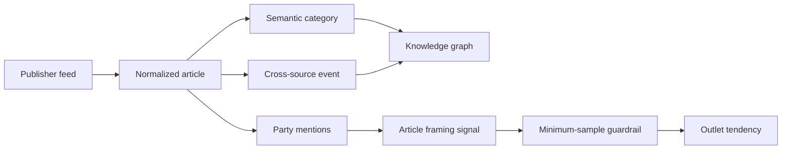

# News knowledge and political framing

Status: first auditable implementation, August 2026

## The product story

A newsroom does not receive isolated articles. It receives many accounts of the same real-world event, published at different times and written from different editorial perspectives. The useful unit is therefore not only an article. It is a chain:

1. A publisher produces an article.
2. The article is assigned a subject category.
3. Reports about the same occurrence are grouped into an event.
4. The event becomes a node in a living timeline.
5. If political actors are discussed, the system records what was discussed and how it was framed.
6. Only after enough comparable articles exist may the system describe an outlet-level tendency.

That last distinction is fundamental. Reporting about a left-wing party is not left-wing reporting. The political-intelligence layer must first identify the actor, then evaluate the language used toward that actor, and only then aggregate repeated evidence.



## What the knowledge page now does

The event map occupies the full content container. Category nodes sit on the left, event nodes occupy the timeline, and publisher nodes sit on the right. A user can:

- drag empty canvas space to pan;
- use a mouse wheel or trackpad to zoom around the pointer;
- use accessible zoom-in, zoom-out, and reset buttons;
- select an event node with a pointer or keyboard;
- inspect all reports for that event in a horizontal, snap-scrolling article rail;
- filter the server-backed graph by time window and semantic category through URL query parameters.

The graph is native SVG. No graph dependency was added because the existing deterministic layout already supplied the nodes and edges; a viewport transform was sufficient for mind-map interaction.

## The political spectrum is one named axis

“Left” and “right” are not complete descriptions of Sri Lankan politics. Economic policy, nationalism, minority rights, institutional reform, and social values do not always move together. A single anonymous score would hide those differences.

The first release therefore names its axis explicitly:

> **Economic policy: state-led (-1) to market-led (+1)**

This is a provisional analytical baseline, not a moral rating, a measure of truth, or a permanent label. Party rows store a confidence, rationale, and evidence URLs so the placement can be reviewed and updated as manifestos and governing records change.

### Initial party baseline

| Party | Position | Display band | Why it starts there | Confidence |
| --- | ---: | --- | --- | ---: |
| Frontline Socialist Party (FSP) | -0.95 | Far left | Explicit Marxist orientation | 0.82 |
| Janatha Vimukthi Peramuna (JVP) | -0.90 | Far left | Marxist-Leninist roots and socialist programme | 0.92 |
| National People's Power (NPP) | -0.40 | Center-left | Equity, economic democracy, and social protection combined with a mixed, market-participating economy | 0.78 |
| Sri Lanka Freedom Party (SLFP) | -0.25 | Center-left | Historically state-oriented and social-democratic, with later market-policy convergence | 0.70 |
| Sri Lanka Podujana Peramuna (SLPP) | +0.05 | Center | Mixed populist economic record; clearer on nationalism than on a stable economic left/right position | 0.55 |
| Samagi Jana Balawegaya (SJB) | +0.15 | Center | Social-market and welfare commitments alongside market-friendly policy | 0.62 |
| United National Party (UNP) | +0.55 | Center-right | Historically the most market-liberal major party | 0.82 |

The NPP and JVP are intentionally separate. The JVP retains a far-left historical and organizational baseline. The broader NPP coalition sits between the left and center and closer to the center, reflecting its broader membership and mixed-economy programme.

The initial evidence set includes:

- [Election Commission recognized-party register](https://elections.gov.lk/en/political_party/political_party_list_E.html)
- [JVP official publications](https://www.jvpsrilanka.com/english/)
- [NPP official policy site](https://www.npp.lk/en)
- [NPP policy statement](https://www.npp.lk/up/policies/en/npppolicystatement.pdf)
- [Verité Research: Mapping Sri Lanka's Political Parties](https://www.veriteresearch.org/publication/mapping-sri-lankas-political-parties/)
- [LSE Research Online: Sectarian socialism and the JVP](https://eprints.lse.ac.uk/41306/)
- [SJB economic blueprint reporting](https://www.ft.lk/top-story/SJB-unveils-economic-blueprint-V3-with-a-view-for-Presidency/26-766363)

## How article framing is calculated

The current model is `political-framing-rules-v1`. It is transparent weak supervision, not a trained black-box classifier.

### Step 1: find political actors

Each party stores English and Sinhala aliases, including common abbreviations and major leader names. The analyzer scans the headline and description and records unique token positions. Articles without a recognized actor receive no political label.

### Step 2: inspect local narrative context

For every mention, the analyzer inspects a small token window around that mention. It counts favorable and critical terms in English and Sinhala. Local windows matter because one headline may praise one party while criticizing another.

For a party mention:

```text
stance = (favorable_terms - critical_terms)
         / (favorable_terms + critical_terms)
```

The result ranges from `-1` (critical) through `0` (neutral or unclear) to `+1` (favorable). If no directional evidence is present, the system records the mention but deliberately keeps confidence below the scoring threshold.

### Step 3: separate actor position from narrative stance

An article's economic framing signal is a confidence-weighted combination:

```text
article_frame = weighted_mean(party_economic_position × stance_toward_party)
```

Examples:

- favorable framing of JVP contributes leftward;
- critical framing of JVP contributes rightward;
- favorable framing of UNP contributes rightward;
- a neutral mention contributes no directional signal;
- conflicting evidence reduces or cancels the final signal.

This multiplication is why party coverage and article framing are separate concepts.

### Step 4: aggregate an outlet only when evidence is sufficient

An outlet needs at least five confidently scored reports in the selected time window. Below that threshold the UI says **insufficient directional evidence**.

Qualified article signals use a confidence-weighted mean, then a neutral prior shrinks small samples toward zero:

```text
raw_outlet_frame = sum(article_frame × confidence) / sum(confidence)
shrunk_frame     = raw_outlet_frame × n / (n + 5)
```

The shrinkage prevents five extreme headlines from being displayed as a permanent, high-confidence outlet identity. Time-window filters also mean the metric describes recent framing, not an immutable property of a publisher.

## Metric contract

| Metric | Grain | Definition | Guardrail |
| --- | --- | --- | --- |
| Party mention coverage | Article | Article contains at least one recognized alias | Does not imply a political leaning |
| Article economic frame | Article | Weighted party position multiplied by local stance | Direction hidden below 0.45 confidence |
| Scored reports | Source × time window | Party-related reports at or above 0.45 confidence | Minimum five before outlet placement |
| Outlet framing tendency | Source × time window | Confidence-weighted, neutral-shrunk mean | Recomputed per URL time/category filter |
| Party baseline confidence | Party | Confidence in curated economic placement | Rationale and source evidence are mandatory |

These metrics must not be used to claim that an article is true or false, that an outlet supports a party, or that a party has only one ideological dimension.

## Data model and runtime

Migration `000017_political_framing` adds:

- `political_parties`: editable baselines, aliases, confidence, rationale, and evidence;
- `article_political_analysis`: model version, economic frame, confidence, mention evidence, and analysis timestamp.

The ingest worker runs political backfill after polling. It analyzes published articles that have no result or an older model version. New model versions can therefore re-evaluate the corpus without deleting source articles.

The existing `/api/admin/knowledge-graph` response includes:

- political analysis on relevant article cards;
- the current party baseline;
- outlet aggregates for the selected server-side time/category scope;
- the minimum-sample and model metadata needed by the UI.

The current implementation lives in:

- `services/api/internal/politics/analyze.go`
- `services/api/internal/desk/store.go`
- `services/api/migrations/000017_political_framing.up.sql`
- `apps/admin/src/pages/knowledge-graph-page.tsx`
- `apps/admin/src/lib/knowledge-graph.ts`

## Validation snapshot

The first local backfill evaluated 572 published articles. Twenty-six contained a recognized party reference. None had enough high-confidence directional language to qualify an outlet for placement, so the UI correctly displayed every observed outlet as **insufficient** rather than inventing a leaning.

That is a successful guardrail, not a failed model. The page can always show the evidence it has; it must never manufacture certainty to make a chart look populated.

## Moving from rules to multilingual machine learning

The rules model is a bootstrap and audit baseline. It should remain available even after an ML model is introduced because it provides deterministic fallback behavior and interpretable regression cases.

### Phase 1: build the labeled dataset

1. Sample at least 500 party-context spans across Sinhala, Tamil, and English.
2. Split by event and time, not random article row, so near-duplicate reports cannot leak into train and test sets.
3. Have two Sri Lankan political-context annotators label:
   - party/entity;
   - favorable, neutral, critical, or unclear stance;
   - evidence phrase;
   - whether the context is quotation, reporter narration, or headline framing.
4. Measure inter-annotator agreement and adjudicate disagreements before training.

### Phase 2: train and calibrate

A small multilingual encoder or embedding classifier is sufficient; a generative model is not required for every article. Compare it against the rules baseline using:

- macro F1 across favorable/neutral/critical classes;
- per-language recall;
- expected calibration error;
- precision at the chosen abstention threshold;
- coverage: the percentage of articles the model is confident enough to score.

The release target should optimize calibrated precision, not raw coverage. “Unclear” is a valid and often preferable result.

### Phase 3: shadow deployment

Run the trained model beside `political-framing-rules-v1` without changing the UI. Store disagreements for editorial review. Promote the model only when it is calibrated across languages and parties, not merely accurate on the majority class.

### Phase 4: governance and drift

- review party baselines after elections, manifestos, splits, and coalition changes;
- maintain an immutable history of baseline edits;
- monitor score distribution by language and publisher;
- audit false positives involving personal names and abbreviations;
- provide an editorial correction mechanism;
- never train directly on an outlet-level label inferred by this system, which would create a feedback loop.

## Mentorship notes: why the system is designed this way

The tempting implementation is to ask a model, “Is this article left or right?” and draw a confident dot. That is easy to demo and hard to defend.

The engineering lesson is to decompose an ambiguous judgment into observable steps. We can inspect whether an actor was mentioned. We can show the words that affected a stance score. We can document the party baseline. We can count the sample. We can abstain. Each stage can be tested, corrected, and eventually replaced by a better model without changing the product's conceptual contract.

The UI follows the same principle. It displays the curated party map, article-level evidence, and source aggregate as separate layers. A user can understand where a result came from and where uncertainty entered the pipeline. That traceability is more valuable than a visually impressive but unexplained “bias score.”

## Operational checks

After a migration or model-version change:

1. Run database migrations.
2. Start or restart the worker; the periodic poll performs the backfill.
3. Confirm published and analyzed counts are plausible.
4. Inspect party-mention examples for false aliases.
5. Confirm low-confidence articles display “Framing unclear.”
6. Confirm sources below five scored articles remain “insufficient.”
7. Test the 1-, 7-, and 30-day URL filters independently.
8. Run Go tests and vet, admin tests, type checking, and the production build.
9. Browser-test desktop and mobile layouts, keyboard event selection, canvas pan/zoom/reset, and horizontal article scrolling.

Any model update must increase the model version, include a labeled evaluation report, and preserve the ability to explain every displayed source-level point.
