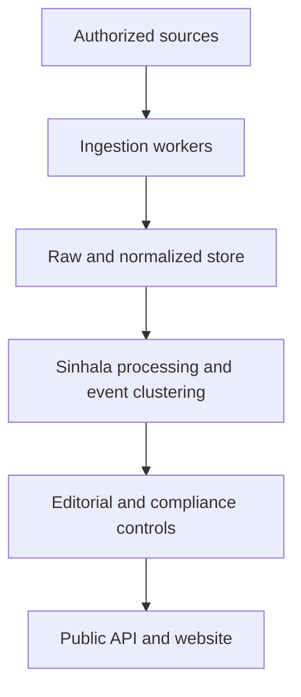

# Software Requirements Specification

## Sinhala News Aggregation and Discovery Platform

**Document version:** 1.0  
**Status:** Draft for product, engineering, legal, and publisher review  
**Prepared:** 15 August 2026  
**Primary locale:** Sinhala (`si-LK`)  
**Working product name:** Sinhala News Aggregation Platform (SNAP)

---

## 1. Document Control

### 1.1 Purpose

This Software Requirements Specification (SRS) defines the requirements for a web-based platform that collects, normalizes, organizes, and presents Sinhala news from credible Sri Lankan and international publishers through authorized machine-readable channels.

The system will use official RSS/Atom feeds, publisher APIs, licensed syndication feeds, approved webhooks, official YouTube APIs, and other explicitly authorized integrations. It will not scrape publisher HTML pages or bypass access controls.

### 1.2 Intended audience

This document is intended for:

- Product owners and project sponsors
- Software architects and developers
- UI/UX designers
- Quality assurance engineers
- DevOps and security engineers
- Editors and content administrators
- Legal and copyright reviewers
- News publishers and syndication partners

### 1.3 Document conventions

- **Shall** indicates a mandatory requirement.
- **Should** indicates a recommended requirement.
- **May** indicates an optional capability.
- Functional requirements use the format `FR-<AREA>-NNN`.
- Non-functional requirements use the format `NFR-<AREA>-NNN`.
- Priorities are **Must**, **Should**, or **Could**.

### 1.4 References

- [Sri Lanka Intellectual Property Act No. 36 of 2003](https://www.wipo.int/wipolex/en/legislation/details/6705)
- [BBC News Sinhala RSS](https://feeds.bbci.co.uk/sinhala/rss.xml)
- [BBC World Service RSS repository](https://github.com/bbc/world-service-rss)
- [Lankadeepa official RSS directory](https://www.lankadeepa.lk/rss)
- [Ada.lk official RSS directory](https://www.ada.lk/rss)
- [ITN News RSS](https://www.itnnews.lk/feed/)
- [Government News Portal FAQ](https://www.news.lk/help-faq)
- [YouTube Data API](https://developers.google.com/youtube/v3/docs)
- [Central Bank of Sri Lanka RSS feeds](https://www.cbsl.gov.lk/en/rss-feeds)
- [Media Ownership Monitor Sri Lanka](https://sri-lanka.mom-gmr.org/en/)

### 1.5 Legal disclaimer

This SRS defines technical and operational safeguards but is not legal advice. Before commercial launch, a Sri Lankan intellectual-property/media lawyer shall review the publication model, publisher agreements, attribution format, use of excerpts, automated summaries, trademarks, images, videos, and data-retention practices.

---

## 2. Product Overview

### 2.1 Product vision

The product will provide one fast, transparent, Sinhala-first destination where users can discover current Sri Lankan news, compare coverage from multiple publishers, and follow links to the original reporting.

### 2.2 Product goals

1. Collect Sinhala news through legal and publisher-authorized methods.
2. Make breaking news discoverable within minutes of publication.
3. Preserve the original source, canonical URL, headline, and timestamp.
4. Group duplicate reports about the same event without hiding source diversity.
5. Clearly distinguish private media, state media, official government statements, independent media, and international media.
6. Provide a responsive, accessible, fast Sinhala web experience.
7. Give administrators control over source rights, ingestion, corrections, and removals.
8. Maintain complete provenance and an auditable history for every published item.

### 2.3 Success metrics

The initial production release should achieve:

- At least four verified machine-readable Sinhala sources enabled at launch.
- At least eight publisher or official-channel integrations within six months.
- 95% of eligible feed items available on the platform within five minutes of appearing in the source feed.
- Less than 2% duplicate cards for the same source article.
- At least 90% precision in automatic same-event clustering before editorial overrides.
- Zero known cases of publishing full copyrighted articles or unlicensed publisher images.
- 99.9% monthly availability for the public read service, excluding planned maintenance.

### 2.4 In scope

- Sinhala news ingestion from authorized RSS, Atom, JSON Feed, API, webhook, and YouTube sources
- Source onboarding and rights management
- Feed polling and API synchronization
- Article metadata normalization
- Sinhala Unicode processing
- Category and topic classification
- Duplicate detection and event clustering
- Source and ownership labels
- Public latest-news, event, category, source, and search pages
- Link-out to original publisher content
- Editorial and administrative portal
- Corrections, unpublishing, and removal workflows
- Monitoring, analytics, security, backups, and audit logging

### 2.5 Out of scope for the initial release

- HTML page scraping or browser automation against publisher sites
- Circumvention of paywalls, bot protection, authentication, rate limits, or `403` responses
- Republishing complete publisher articles
- Downloading or rehosting publisher videos or audio
- Republishing publisher images without an explicit licence
- Automatic translation of copyrighted articles
- Automatic single-source AI summaries without explicit publisher permission
- User comments and public discussion forums
- Native iOS and Android applications
- Personalized political profiling
- Automated determination that a publisher is universally “true,” “false,” or unbiased

---

## 3. Stakeholders and User Roles

| Role | Description | Main capabilities |
|---|---|---|
| Public reader | Any visitor using the website | Browse, search, filter, compare sources, and open original articles |
| Editor | Reviews and manages published news | Correct classification, merge/split events, add editorial notes, publish/unpublish |
| Source manager | Onboards publishers and manages rights | Configure endpoints, polling, licences, allowed fields, and contacts |
| Administrator | Manages the complete system | Manage users, roles, configuration, security, and all editorial functions |
| Compliance reviewer | Reviews copyright and publisher obligations | Approve rights profiles, handle complaints and removal requests, inspect audit history |
| Operations engineer | Maintains reliability and infrastructure | Monitor jobs, retry failures, review alerts, and manage deployments |
| Publisher representative | External stakeholder providing a feed or licence | Confirm endpoints, rights, corrections, and takedown requests |

---

## 4. Assumptions, Dependencies, and Constraints

### 4.1 Assumptions

- The service will initially be a public, advertising-free or lightly monetized news-discovery website.
- Public readers will not need an account in the MVP.
- Administrative users will be invited by an administrator.
- The system will operate primarily in Sinhala, while technical administration may be available in English.
- Publisher feeds may be delayed, incomplete, malformed, temporarily unavailable, or changed without notice.
- “Real time” means near-real-time delivery after the publisher exposes an item through an approved endpoint.

### 4.2 Dependencies

- Availability and stability of publisher feeds and APIs
- Publisher authorization and licensing terms
- YouTube Data API availability and quota
- DNS, CDN, hosting, database, queue, object storage, and monitoring providers
- Optional AI/NLP services used for classification or clustering
- Legal review and publisher communication

### 4.3 Constraints

- All text shall be stored and served as UTF-8.
- Public-facing dates shall use the Asia/Colombo timezone by default.
- Each item shall retain the publisher-provided timestamp and the platform ingestion timestamp.
- The system shall not infer republication rights solely from the existence of an RSS or API endpoint.
- Rights controls shall be enforced in backend publication logic, not only in the UI.

---

## 5. High-Level System Architecture



### 5.1 Logical components

1. **Source Registry** — source identity, ownership type, endpoints, polling rules, and rights.
2. **Ingestion Service** — RSS/Atom/API/webhook/YouTube connectors and scheduling.
3. **Normalization Service** — common schema, encoding, timestamps, canonical URLs, and content hashes.
4. **Content Intelligence Service** — language validation, categories, entities, deduplication, and event clustering.
5. **Editorial Service** — manual review, overrides, corrections, removals, and audit trail.
6. **Public Read API** — optimized read endpoints for the website and future clients.
7. **Web Application** — responsive Sinhala reader experience.
8. **Administration Portal** — source, rights, editorial, user, and operational management.
9. **Observability Layer** — logs, metrics, traces, alerts, dashboards, and job history.

### 5.2 Recommended architectural style

The MVP may be implemented as a modular monolith with independently runnable background workers. The design shall keep ingestion, processing, public reads, and administration logically separated so they can be extracted into services if traffic or team size requires it.

---

## 6. Source and Rights Model

### 6.1 Source access is separate from display permission

Every source shall have two independent states:

1. **Technical access state** — whether the system can legally retrieve data through an official endpoint.
2. **Display-rights state** — which received fields the platform may store and publish.

An enabled endpoint shall not automatically make its content publicly visible.

### 6.2 Rights profiles

Each source shall have a versioned rights profile containing:

- Publisher legal name
- Publication/brand name
- Ownership type: private, state-owned, government, independent, international, or other
- Official website and contact information
- Access method and endpoint
- Contract, licence, public terms, or written-approval reference
- Commercial-use permission
- Allowed public fields
- Maximum excerpt length
- Thumbnail/image permission
- Video/audio permission
- Logo/trademark permission
- Translation permission
- Automated-summary permission
- Raw-payload retention period
- Public-item retention period
- Attribution wording
- Required canonical-link behavior
- Correction and deletion process
- Effective date and expiry/review date
- Approver identity and approval timestamp

### 6.3 Rights modes

| Mode | Public behavior |
|---|---|
| Discovery only | Publish source name, headline, timestamp, category, canonical URL, and an original-link button, subject to terms |
| Licensed excerpt | Additionally publish the permitted publisher-supplied excerpt |
| Licensed media | Additionally display approved thumbnail, image, audio, or embedded media |
| Full syndication | Publish fields explicitly covered by a negotiated syndication contract |
| Internal verification only | Ingest for editorial comparison but do not expose the item publicly |
| Disabled | Do not retrieve or publish |

---

## 7. Functional Requirements

### 7.1 Source Registry

| ID | Requirement | Priority |
|---|---|---|
| FR-SRC-001 | The system shall allow authorized users to create, view, edit, disable, and archive a news source. | Must |
| FR-SRC-002 | The system shall store one or more endpoints per source. | Must |
| FR-SRC-003 | Each endpoint shall specify its type: RSS 2.0, Atom, JSON Feed, REST API, webhook, or YouTube channel. | Must |
| FR-SRC-004 | The system shall require a rights profile before an endpoint can publish content publicly. | Must |
| FR-SRC-005 | The system shall support different rights profiles for different endpoints belonging to the same publisher. | Should |
| FR-SRC-006 | The system shall record whether endpoint ownership was verified through the publisher’s official website or written confirmation. | Must |
| FR-SRC-007 | The system shall provide a test action that validates connectivity, content type, encoding, latest-item time, and parseability without enabling publication. | Must |
| FR-SRC-008 | The system shall maintain a history of endpoint and rights-profile changes. | Must |
| FR-SRC-009 | The system shall automatically disable public publishing when a rights profile expires, while preserving records for review. | Must |
| FR-SRC-010 | The system shall support source-specific attribution text and original-link labels. | Should |

### 7.2 Feed and API Ingestion

| ID | Requirement | Priority |
|---|---|---|
| FR-ING-001 | The system shall ingest RSS 2.0 and Atom feeds. | Must |
| FR-ING-002 | The system shall support JSON Feed and publisher REST APIs through configurable connectors. | Should |
| FR-ING-003 | The system shall support authenticated APIs using securely stored API keys or OAuth credentials. | Should |
| FR-ING-004 | The system shall support signed publisher webhooks. | Should |
| FR-ING-005 | The system shall retrieve official YouTube uploads using the YouTube Data API. | Should |
| FR-ING-006 | Polling intervals shall be configurable per endpoint, with a default of five minutes. | Must |
| FR-ING-007 | The system shall honor `ETag`, `Last-Modified`, `Cache-Control`, `Retry-After`, and API rate-limit headers where supplied. | Must |
| FR-ING-008 | The system shall use exponential backoff with jitter for transient failures. | Must |
| FR-ING-009 | The system shall not repeatedly retry authentication failures, forbidden responses, or explicit access denials. | Must |
| FR-ING-010 | The system shall not follow a redirect from an approved endpoint to an unapproved domain without validation. | Must |
| FR-ING-011 | Each ingestion run shall record start time, end time, status, HTTP result, item count, new-item count, and error details. | Must |
| FR-ING-012 | Ingestion shall be idempotent: processing the same source item more than once shall not create duplicate records. | Must |
| FR-ING-013 | The system shall place unparseable payloads in a quarantine state for inspection. | Must |
| FR-ING-014 | A malformed item shall not prevent valid items from the same response from being processed. | Should |
| FR-ING-015 | Raw source payloads shall be retained only for the duration permitted by the rights profile. | Must |
| FR-ING-016 | The system shall expose an operator action to pause, resume, and manually run an endpoint. | Must |
| FR-ING-017 | The system shall alert operators when a previously healthy source has no successful update for a configurable period. | Must |

### 7.3 Normalization and Provenance

| ID | Requirement | Priority |
|---|---|---|
| FR-NRM-001 | The system shall normalize ingested items into one common article schema. | Must |
| FR-NRM-002 | The original publisher headline shall be preserved without silent editing. | Must |
| FR-NRM-003 | The system shall preserve the source item identifier, original URL, canonical URL, published time, updated time, author/byline, categories, and supplied description when available. | Must |
| FR-NRM-004 | Every article shall store the source, endpoint, ingestion run, retrieval time, and applicable rights-profile version. | Must |
| FR-NRM-005 | URLs shall be normalized by removing known tracking parameters while preserving the canonical destination. | Should |
| FR-NRM-006 | The system shall calculate a stable content fingerprint from source identity, source item ID, canonical URL, headline, and timestamp. | Must |
| FR-NRM-007 | Publisher timestamps without an explicit timezone shall be interpreted using the endpoint’s configured timezone. | Must |
| FR-NRM-008 | The system shall record all automated and manual transformations applied to an item. | Must |
| FR-NRM-009 | Fields prohibited by the active rights profile shall not be copied into the public-read model or search index. | Must |

### 7.4 Sinhala Language Processing

| ID | Requirement | Priority |
|---|---|---|
| FR-SIN-001 | The system shall store and serve Sinhala text using UTF-8. | Must |
| FR-SIN-002 | The system shall normalize text to Unicode NFC while retaining the unmodified source value for audit purposes. | Must |
| FR-SIN-003 | The system shall identify whether an item is predominantly Sinhala. | Must |
| FR-SIN-004 | Non-Sinhala items shall be excluded from the default Sinhala feed unless manually approved or explicitly categorized. | Must |
| FR-SIN-005 | Search shall support Sinhala Unicode input and common mixed Sinhala-English queries. | Must |
| FR-SIN-006 | The system shall avoid automatic transliteration or translation in the MVP. | Must |
| FR-SIN-007 | Sinhala text processing shall handle zero-width characters, visually similar Unicode sequences, punctuation variants, and whitespace normalization. | Should |
| FR-SIN-008 | The system should support a configurable Sinhala stop-word list for search and clustering without modifying displayed headlines. | Should |

### 7.5 Classification and Enrichment

| ID | Requirement | Priority |
|---|---|---|
| FR-CLS-001 | The system shall classify items into a controlled category taxonomy. | Must |
| FR-CLS-002 | Initial categories shall include latest, politics, economy/business, local, world, sport, technology, health, environment/weather, crime/courts, education, entertainment, and official announcements. | Must |
| FR-CLS-003 | Publisher-provided categories shall be retained separately from platform categories. | Must |
| FR-CLS-004 | Automatic category predictions shall include a confidence value and model/version identifier. | Must |
| FR-CLS-005 | Low-confidence classifications shall use a fallback category or enter an editorial-review queue. | Must |
| FR-CLS-006 | Editors shall be able to override categories and topics. | Must |
| FR-CLS-007 | The system should extract named entities such as people, organizations, locations, and institutions for discovery and clustering. | Should |
| FR-CLS-008 | Automated enrichment shall not introduce unsupported factual claims into public content. | Must |

### 7.6 Deduplication and Event Clustering

| ID | Requirement | Priority |
|---|---|---|
| FR-CLU-001 | The system shall detect exact duplicates using source IDs, canonical URLs, and content fingerprints. | Must |
| FR-CLU-002 | The system shall detect likely duplicate items from the same publisher using normalized-title similarity and publication-time proximity. | Must |
| FR-CLU-003 | The system should group reports from different publishers that describe the same real-world event. | Should |
| FR-CLU-004 | Cross-source clustering shall preserve every original article and source relationship. | Must |
| FR-CLU-005 | The public event view shall never imply that one publisher’s report was produced by another publisher. | Must |
| FR-CLU-006 | Editors shall be able to merge clusters, split clusters, add or remove an article, and lock a cluster against automatic changes. | Must |
| FR-CLU-007 | Automated clustering shall record similarity signals, confidence, algorithm version, and decision time. | Should |
| FR-CLU-008 | Items with materially conflicting facts shall remain individually visible and may be marked as differing reports. | Should |

### 7.7 Publication Workflow

| ID | Requirement | Priority |
|---|---|---|
| FR-PUB-001 | Eligible feed items shall be published automatically only when the source, endpoint, and rights profile are active. | Must |
| FR-PUB-002 | The public item shall include source name, original headline, publication time, platform category, and canonical original URL. | Must |
| FR-PUB-003 | The system shall publish an excerpt, thumbnail, logo, video, or generated summary only when the rights profile explicitly permits that field. | Must |
| FR-PUB-004 | Every card and event-source entry shall provide a prominent link to the original publisher. | Must |
| FR-PUB-005 | The system shall display the item’s source type, such as private media, state media, official government source, international media, or independent media. | Must |
| FR-PUB-006 | The system shall display “Official statement” for content sourced directly from a government information channel where applicable. | Should |
| FR-PUB-007 | The system shall preserve both publisher publication time and platform “received” time. | Should |
| FR-PUB-008 | Editors shall be able to hold a source or category for manual review. | Must |
| FR-PUB-009 | Editors shall be able to unpublish an item without deleting its audit record. | Must |
| FR-PUB-010 | If an original article becomes unavailable, the system shall mark the link as unavailable after verification rather than silently redirecting to another report. | Should |

### 7.8 Public Website

| ID | Requirement | Priority |
|---|---|---|
| FR-WEB-001 | The website shall provide a Sinhala-first home page containing the latest eligible items and event clusters. | Must |
| FR-WEB-002 | The website shall provide category pages. | Must |
| FR-WEB-003 | The website shall provide source pages containing the source description, ownership label, and latest permitted items. | Must |
| FR-WEB-004 | The website shall provide event pages showing reports from multiple sources in chronological order. | Should |
| FR-WEB-005 | The website shall provide full-text metadata search over permitted fields. | Must |
| FR-WEB-006 | Readers shall be able to filter by category, source, source type, and publication date. | Must |
| FR-WEB-007 | The default sorting shall prioritize freshness while preventing one high-volume publisher from occupying the entire first view. | Should |
| FR-WEB-008 | Each result shall show whether it is a single-source report or a multi-source event. | Should |
| FR-WEB-009 | The website shall display original publisher attribution before the original-link action. | Must |
| FR-WEB-010 | The website shall not visually imitate a source’s article page in a way that could confuse users about authorship. | Must |
| FR-WEB-011 | The website shall support responsive desktop, tablet, and mobile layouts. | Must |
| FR-WEB-012 | The website shall provide an accessible “Report a problem” action on item and source pages. | Should |
| FR-WEB-013 | Public URLs shall be stable, human-readable where practical, and shareable. | Must |
| FR-WEB-014 | Social sharing metadata shall describe the aggregation page and shall not claim ownership of publisher content. | Must |

### 7.9 Search

| ID | Requirement | Priority |
|---|---|---|
| FR-SCH-001 | Search shall return results based only on fields authorized for indexing. | Must |
| FR-SCH-002 | Search shall support exact phrase, keyword, source, category, entity, and date filters. | Should |
| FR-SCH-003 | Search results shall show the matched source and original publication time. | Must |
| FR-SCH-004 | Search shall not expose unpublished, expired-rights, quarantined, or internal-verification-only items. | Must |
| FR-SCH-005 | Editors shall be able to reindex an item, source, or date range. | Should |

### 7.10 YouTube and Multimedia

| ID | Requirement | Priority |
|---|---|---|
| FR-MED-001 | The system shall retrieve video metadata only from verified official publisher channels. | Must |
| FR-MED-002 | The system shall identify a channel’s uploads playlist using `channels.list` and retrieve entries using `playlistItems.list`. | Must |
| FR-MED-003 | Public video playback shall use the official YouTube embed player. | Must |
| FR-MED-004 | The system shall not download, transcode, or rehost YouTube videos or audio. | Must |
| FR-MED-005 | Video title, thumbnail, description, and embed visibility shall comply with the source rights profile and YouTube policies. | Must |
| FR-MED-006 | Deleted, private, or region-restricted videos shall be removed from the public player after detection. | Must |

### 7.11 Editorial Administration

| ID | Requirement | Priority |
|---|---|---|
| FR-EDT-001 | The administration portal shall provide queues for quarantined items, low-confidence classifications, reported problems, and rights review. | Must |
| FR-EDT-002 | Editors shall be able to view raw source metadata and the normalized public representation side by side, subject to role permissions. | Must |
| FR-EDT-003 | Editors shall be able to add a clearly labelled platform editorial note without modifying the publisher headline. | Should |
| FR-EDT-004 | Every manual action shall capture the user, time, previous value, new value, and reason. | Must |
| FR-EDT-005 | Bulk actions shall require confirmation and shall be limited by role. | Must |
| FR-EDT-006 | The system shall support previewing an item or event before publication. | Must |
| FR-EDT-007 | Administrators shall be able to suspend all publishing from a source immediately. | Must |
| FR-EDT-008 | The portal shall show source freshness, failure rate, item volume, and rights status. | Must |

### 7.12 Corrections, Deletions, and Complaints

| ID | Requirement | Priority |
|---|---|---|
| FR-COR-001 | The system shall detect publisher updates when a feed item identifier or canonical URL remains stable. | Must |
| FR-COR-002 | Updated source metadata shall create a version rather than silently overwriting provenance. | Must |
| FR-COR-003 | Editors shall be able to mark an item as corrected, updated, disputed, unavailable, or removed. | Must |
| FR-COR-004 | The system shall provide a workflow for publisher and public complaints. | Must |
| FR-COR-005 | A complaint shall record requester details, affected URL, reason, evidence, status, owner, timestamps, and resolution. | Must |
| FR-COR-006 | Authorized compliance users shall be able to remove an item from public views and search immediately while retaining a restricted audit record. | Must |
| FR-COR-007 | Removal and correction actions shall propagate to caches and search indexes within five minutes. | Must |
| FR-COR-008 | The system shall support source-wide emergency unpublishing. | Must |

### 7.13 User and Access Management

| ID | Requirement | Priority |
|---|---|---|
| FR-IAM-001 | Administrative access shall require authenticated accounts. | Must |
| FR-IAM-002 | The system shall implement role-based access control for administrator, source manager, editor, compliance reviewer, and operations engineer roles. | Must |
| FR-IAM-003 | Multi-factor authentication shall be required for privileged users. | Must |
| FR-IAM-004 | User invitations, role changes, suspension, and deletion shall be audited. | Must |
| FR-IAM-005 | Administrative sessions shall expire after a configurable inactivity period. | Must |
| FR-IAM-006 | The system should support SSO for administrative users in a later release. | Could |

### 7.14 Analytics and Reporting

| ID | Requirement | Priority |
|---|---|---|
| FR-ANL-001 | The system shall report item volume, publication delay, ingestion failures, source freshness, link-outs, and popular categories. | Must |
| FR-ANL-002 | Analytics shall distinguish platform page views from outbound clicks to publishers. | Must |
| FR-ANL-003 | Analytics shall not create sensitive political-interest profiles of identifiable readers. | Must |
| FR-ANL-004 | The administration portal should show source diversity on major event clusters. | Should |
| FR-ANL-005 | Reports shall exclude data fields that the active rights profile prohibits retaining. | Must |

---

## 8. Data Requirements

### 8.1 Core entities

| Entity | Purpose | Important fields |
|---|---|---|
| Source | Publisher or official channel | ID, name, legal name, source type, website, country, active status |
| SourceEndpoint | Machine-readable integration | Type, URL/channel ID, authentication reference, interval, timezone, health state |
| RightsProfile | Display and retention permissions | Version, mode, allowed fields, media permissions, dates, approval evidence |
| IngestionRun | Operational history | Endpoint, start/end, status, HTTP metadata, counts, error |
| RawItem | Temporarily retained input | Payload reference, hash, received time, expiry time, rights version |
| Article | Normalized source item | Source ID, source item ID, original/canonical URL, headline, description, times, language |
| ArticleVersion | Change history | Article ID, version, changed fields, source/update time |
| Category | Controlled taxonomy | ID, Sinhala name, English admin name, slug, status |
| EventCluster | Cross-source event grouping | ID, display title, category, confidence, status, first/last update |
| EventArticle | Event-to-article relationship | Event ID, article ID, clustering score, manual/automatic origin |
| EditorialAction | Manual decision history | User, entity, action, before/after, reason, time |
| Complaint | Correction/removal request | Requester, entity, reason, evidence, status, owner, resolution |
| AdminUser | Authorized staff member | Identity, role, MFA state, status, last login |
| AuditLog | Security and compliance record | Actor, action, target, IP/device metadata, timestamp, result |

### 8.2 Article field visibility

Article data shall be separated into:

- **Source-original fields:** exact data received from the publisher.
- **Normalized internal fields:** Unicode, URL, timestamp, category, and fingerprint transformations.
- **Public fields:** only fields permitted by the applicable rights profile.
- **Restricted fields:** raw payloads, internal notes, complaint details, and access credentials.

### 8.3 Retention defaults

| Data type | Default retention | Notes |
|---|---|---|
| Public metadata | Indefinite while authorized | Subject to publisher agreement and removals |
| Raw feed/API payload | 30 days | Shorter if required by rights profile |
| Ingestion logs | 90 days searchable; 1 year archived | Secrets and full copyrighted bodies shall be redacted |
| Audit logs | 7 years | Confirm with legal review |
| Complaint records | 7 years after resolution | Restricted access |
| Analytics events | 13 months | Prefer aggregated or pseudonymous data |
| Backups | 35 days | Deleted data shall age out according to backup policy |

---

## 9. API Requirements

### 9.1 Public API

The web client should consume a versioned, read-only API.

| Method and path | Purpose |
|---|---|
| `GET /api/v1/news` | Paginated latest eligible articles |
| `GET /api/v1/news/{id}` | Public metadata for one article |
| `GET /api/v1/events` | Paginated event clusters |
| `GET /api/v1/events/{id}` | Event details and source reports |
| `GET /api/v1/categories` | Active categories |
| `GET /api/v1/sources` | Public source directory |
| `GET /api/v1/sources/{id}` | Source profile and eligible items |
| `GET /api/v1/search` | Authorized metadata search |

### 9.2 Public response example

```json
{
  "id": "art_01J...",
  "headline": "Publisher-provided Sinhala headline",
  "source": {
    "id": "src_01J...",
    "name": "Example Publisher",
    "type": "private_media"
  },
  "category": {
    "slug": "politics",
    "name_si": "දේශපාලන"
  },
  "published_at": "2026-08-15T08:30:00+05:30",
  "received_at": "2026-08-15T08:32:10+05:30",
  "original_url": "https://publisher.example/article/123",
  "excerpt": null,
  "media": null,
  "event_id": "evt_01J..."
}
```

Null fields indicate that the source did not supply the field or the rights profile does not permit publication.

### 9.3 API behavior

- APIs shall use HTTPS and JSON encoded as UTF-8.
- Collection endpoints shall use cursor-based pagination.
- Public APIs shall return only published, authorized fields.
- Error responses shall use a consistent machine-readable format.
- Rate limits shall be applied per client/IP with protection for abusive traffic.
- Administrative APIs shall not share authorization policies with public APIs.
- API responses shall include stable identifiers, not internal database sequence numbers.

---

## 10. External Interface Requirements

### 10.1 Public user interface

- Primary navigation shall be in Sinhala.
- The layout shall correctly render Sinhala type at common mobile and desktop sizes.
- Source attribution shall remain visible and shall not be hidden in hover-only interactions.
- Original-link actions shall clearly indicate that the user is leaving the platform.
- Event pages shall present source reports as separate cards, with publication times and source labels.
- The design shall avoid presenting an automatically selected source as the definitive account of an event.

### 10.2 Administration interface

- The administration portal may use English, Sinhala, or a combination selected by the organization.
- Dangerous actions such as disabling a source, mass unpublishing, and changing rights shall require explicit confirmation.
- Rights profiles shall show a clear summary of what can and cannot be published.
- Health indicators shall use text and icons in addition to color.

### 10.3 Publisher interfaces

- RSS 2.0 and Atom over HTTPS
- JSON Feed over HTTPS
- REST APIs using documented authentication
- Signed HTTPS webhooks
- YouTube Data API for verified official channels
- Optional publisher correction/deletion webhook or API

---

## 11. Non-Functional Requirements

### 11.1 Performance

| ID | Requirement | Priority |
|---|---|---|
| NFR-PER-001 | The public API shall have a p95 response time below 500 ms for cached list queries under normal load. | Must |
| NFR-PER-002 | Search shall return the first page within 1 second at p95 under normal load. | Must |
| NFR-PER-003 | The public website should achieve a p75 Largest Contentful Paint below 2.5 seconds on a representative mobile 4G connection. | Should |
| NFR-PER-004 | Eligible items shall become public within five minutes at p95 after appearing in a successfully retrieved source endpoint. | Must |
| NFR-PER-005 | Corrections and removals shall propagate to public caches and indexes within five minutes. | Must |

### 11.2 Capacity and scalability

| ID | Requirement | Priority |
|---|---|---|
| NFR-SCL-001 | The initial system shall support at least 50 sources and 200 endpoints. | Must |
| NFR-SCL-002 | The initial system shall support at least 100,000 new article records per month. | Must |
| NFR-SCL-003 | Public read services shall support a burst of at least 100 requests per second without data loss. | Should |
| NFR-SCL-004 | Ingestion workers shall scale independently from public web traffic. | Must |

### 11.3 Availability and recovery

| ID | Requirement | Priority |
|---|---|---|
| NFR-AVL-001 | The public read service shall target 99.9% monthly availability. | Must |
| NFR-AVL-002 | Failure of one source connector shall not stop other connectors. | Must |
| NFR-AVL-003 | The system shall have an RPO of 15 minutes for primary content and configuration data. | Should |
| NFR-AVL-004 | The system shall have an RTO of four hours for a regional or primary-database failure. | Should |
| NFR-AVL-005 | Backup restoration shall be tested at least quarterly. | Must |

### 11.4 Security

| ID | Requirement | Priority |
|---|---|---|
| NFR-SEC-001 | All network communication shall use TLS 1.2 or later. | Must |
| NFR-SEC-002 | Secrets shall be stored in a managed secret store and never in source code, logs, or public configuration. | Must |
| NFR-SEC-003 | Administrative authentication shall support MFA and secure password/session policies. | Must |
| NFR-SEC-004 | The application shall follow OWASP ASVS and OWASP Top 10 guidance appropriate to its risk level. | Must |
| NFR-SEC-005 | Feed and webhook processing shall protect against SSRF, XML external entity attacks, oversized payloads, decompression bombs, malicious redirects, and stored XSS. | Must |
| NFR-SEC-006 | Publisher-supplied HTML shall be rejected or sanitized using an allowlist before any permitted excerpt is rendered. | Must |
| NFR-SEC-007 | All administrative mutations shall be audited. | Must |
| NFR-SEC-008 | Dependencies and container images shall be scanned continuously for known vulnerabilities. | Should |
| NFR-SEC-009 | A security incident response process and contact list shall be documented before production. | Must |

### 11.5 Privacy

| ID | Requirement | Priority |
|---|---|---|
| NFR-PRV-001 | The public website shall collect only the minimum reader data required for security and aggregated analytics. | Must |
| NFR-PRV-002 | Analytics identifiers shall not be used to infer sensitive political beliefs. | Must |
| NFR-PRV-003 | Administrative and complaint personal data shall be access-controlled and encrypted at rest. | Must |
| NFR-PRV-004 | The website shall provide a privacy notice and cookie controls appropriate to its deployment markets, including the EU if operated from Germany. | Must |
| NFR-PRV-005 | Data-subject and deletion-request procedures shall be documented before production. | Must |

### 11.6 Accessibility and usability

| ID | Requirement | Priority |
|---|---|---|
| NFR-ACC-001 | The public site and administration portal shall target WCAG 2.2 AA. | Must |
| NFR-ACC-002 | All functionality shall be keyboard accessible. | Must |
| NFR-ACC-003 | Text shall remain readable at 200% zoom without loss of functionality. | Must |
| NFR-ACC-004 | Images shall have appropriate alternative text; decorative images shall be ignored by assistive technology. | Must |
| NFR-ACC-005 | The selected Sinhala font shall provide complete glyph coverage and remain legible at small sizes. | Must |

### 11.7 SEO and interoperability

| ID | Requirement | Priority |
|---|---|---|
| NFR-SEO-001 | Public pages shall provide canonical URLs and Sinhala language metadata. | Must |
| NFR-SEO-002 | Pages should include appropriate `lang="si"` or `si-LK` markup. | Should |
| NFR-SEO-003 | Search-engine metadata shall identify the platform as an aggregator and retain source attribution. | Must |
| NFR-SEO-004 | The platform shall not expose publisher article bodies in structured data when those bodies are not licensed for publication. | Must |

### 11.8 Maintainability and quality

| ID | Requirement | Priority |
|---|---|---|
| NFR-MNT-001 | Connectors shall implement a common interface and be independently testable. | Must |
| NFR-MNT-002 | Source-specific parsing rules shall be configuration-driven where practical. | Should |
| NFR-MNT-003 | Database migrations shall be versioned, reviewed, and reversible where safe. | Must |
| NFR-MNT-004 | Core ingestion, rights enforcement, deduplication, publication, and removal logic shall have automated tests. | Must |
| NFR-MNT-005 | Production deployments shall use automated CI/CD with review and rollback capability. | Must |

### 11.9 Observability

| ID | Requirement | Priority |
|---|---|---|
| NFR-OBS-001 | The system shall emit structured logs with correlation IDs. | Must |
| NFR-OBS-002 | Metrics shall include endpoint health, poll duration, item counts, parse failures, publication delay, queue depth, API latency, and error rate. | Must |
| NFR-OBS-003 | Distributed traces should connect ingestion, processing, storage, and publication for sampled items. | Should |
| NFR-OBS-004 | Alerts shall exist for sustained ingestion failure, abnormal item volume, rights expiry, queue backlog, public API errors, and backup failure. | Must |
| NFR-OBS-005 | Logs shall redact credentials, personal data, and copyrighted bodies not needed for diagnostics. | Must |

---

## 12. Initial Source Onboarding Plan

The following matrix is a planning baseline. Every endpoint and right shall be revalidated immediately before production activation.

| Source | Technical method | Initial system mode | Required action before launch |
|---|---|---|---|
| BBC News Sinhala | `https://feeds.bbci.co.uk/sinhala/rss.xml` | Discovery only | Review BBC feed terms and obtain commercial licence if needed |
| Lankadeepa | Official category RSS directory | Discovery only | Select category feeds and confirm permitted public fields |
| Ada.lk | Official category RSS directory | Discovery only | Confirm permitted public fields |
| ITN News | `https://www.itnnews.lk/feed/` | Discovery only | Confirm commercial display rights and state-media attribution |
| Ada Derana Sinhala | RSS advertised on official site | Disabled until verified | Obtain current Sinhala endpoint and written rights confirmation |
| News.lk Sinhala | RSS/newsletter advertised | Internal verification only | Obtain exact endpoint and Department of Government Information approval |
| Vikalpa | `https://www.vikalpa.org/feed` | Discovery or licensed redistribution | Confirm CC BY-ND applicability per item; do not translate or summarize without permission |
| Sri Lanka Mirror Sinhala | Joomla feed-format endpoint | Disabled until verified | Validate endpoint ownership/content type and obtain display permission |
| LankaPuvath | Publisher syndication partnership | Disabled until contracted | Negotiate RSS/JSON/webhook and commercial rights |
| Hiru News | Official YouTube API and publisher partnership | Video embeds only | Verify official channel; request text feed/API |
| NewsFirst Sinhala | Official YouTube API and publisher partnership | Video embeds only | Verify official channel; do not depend on legacy feed references |
| Neth News | Official YouTube API and publisher partnership | Video embeds only | Verify channel and request text feed/API |
| Siyatha News | Official YouTube API and publisher partnership | Video embeds only | Verify channel and request text feed/API |
| Rupavahini News | Official YouTube API and SLRC agreement | Video embeds only | Verify channel and state-media label |
| Swarnavahini News | Official YouTube API and publisher agreement | Video embeds only | Verify channel and request text syndication |
| Dinamina | Publisher agreement | Disabled until verified | Request an official current feed and rights profile from Lake House |
| Divaina | Publisher agreement | Disabled until contracted | Request feed/API and syndication rights |
| Mawbima | Publisher agreement | Disabled until contracted | Request feed/API; do not bypass access restrictions |
| Aruna | Publisher agreement | Disabled until contracted | Request feed/API and field-level rights |
| Silumina | Publisher agreement | Disabled until contracted | Treat primarily as weekly analysis/features |
| Central Bank of Sri Lanka | Official RSS directory | Official verification | Select economic feeds and confirm reuse terms |
| NewsData.io | Commercial aggregator API | Optional discovery backup | Confirm freshness, source coverage, and contractual publication rights |

---

## 13. Business Rules

1. An item may be public only if its source, endpoint, and rights profile are active.
2. The strictest applicable rights rule shall win when multiple rules conflict.
3. An expired rights profile shall stop new publication automatically.
4. Public content shall link to the publisher’s canonical article whenever available.
5. Attribution is mandatory but shall not be treated as a substitute for permission.
6. Original source headlines shall remain distinguishable from platform editorial notes.
7. A multi-source event shall preserve the identity and timestamp of every source report.
8. Government press releases shall be labelled as official-source material, not independent reporting.
9. State-owned media shall be labelled as such in public source information.
10. Automated models may classify or cluster content but shall not create public factual assertions that are unsupported by authorized source metadata.
11. A takedown or rights suspension shall override ranking, caching, and scheduled publication.
12. The system shall not enable a connector whose access method depends on HTML scraping or circumvention.

---

## 14. Acceptance Criteria

### 14.1 Source onboarding

- A source manager can add a source, endpoint, contact, and rights profile.
- The endpoint can be tested without public publication.
- Public publishing cannot be enabled without an approved rights profile.
- Rights expiry automatically prevents new public items.

### 14.2 Ingestion

- The system successfully parses representative BBC Sinhala, Lankadeepa, Ada.lk, and ITN feeds.
- Reprocessing the same response creates no duplicate article records.
- `ETag` or `Last-Modified` is used when supplied.
- A source returning `403` is paused or alerted; the system does not attempt circumvention.
- Malformed items are quarantined without blocking valid items.

### 14.3 Sinhala processing

- Sinhala headlines render correctly on Chrome, Safari, Firefox, Android, and iOS browsers.
- Canonically equivalent Unicode strings produce the same normalized search form.
- Sinhala search returns relevant results for exact and mixed Sinhala-English queries.
- The displayed original headline remains unchanged.

### 14.4 Rights enforcement

- A discovery-only source exposes no body, excerpt, image, or summary unless specifically allowed.
- Changing a rights profile immediately affects new public responses.
- Suspension or removal clears public caches and the search index within five minutes.
- Every public field can be traced to a source field, editorial field, or explicit permission.

### 14.5 Deduplication and clustering

- Exact duplicates from the same source are suppressed.
- Different publishers’ reports remain separately accessible inside an event cluster.
- Editors can merge, split, and lock clusters.
- Conflicting reports can be displayed without one being silently overwritten.

### 14.6 Public website

- Readers can browse latest news, categories, sources, events, and search results.
- Every news card clearly displays the source and original-link action.
- Source type and ownership information is accessible.
- The site passes agreed accessibility and performance checks.

### 14.7 Security and operations

- MFA is enforced for privileged users.
- Administrative mutations appear in the audit log.
- SSRF, XXE, XSS, malicious redirects, and oversized-feed tests are blocked.
- Alerts are generated for feed failure, queue backlog, rights expiry, and public API degradation.
- A backup restore test completes successfully before production launch.

---

## 15. Testing Strategy

### 15.1 Automated testing

- Unit tests for feed parsing, Unicode normalization, URL canonicalization, fingerprints, rights checks, and category mapping
- Connector contract tests using recorded, legally retained fixtures
- Integration tests for polling, queues, database transactions, search indexing, and cache invalidation
- End-to-end tests for source onboarding, publication, link-out, correction, and takedown workflows
- Security tests for untrusted XML/HTML, SSRF, redirects, authentication, authorization, and rate limits
- Performance tests for public APIs, search, and ingestion bursts

### 15.2 Manual testing

- Sinhala typography and layout review by native Sinhala readers
- Editorial review of category and event-clustering quality
- Legal/compliance review of each source’s public representation
- Accessibility testing with keyboard navigation and screen readers
- Cross-browser and mobile-device validation
- Publisher acceptance testing where required by a contract

### 15.3 Production readiness gates

Production launch shall require:

- Legal approval of the public display model
- At least four verified, healthy sources
- Approved rights profiles for all enabled sources
- Security review with no unresolved critical/high findings
- Tested backup and recovery process
- Monitoring and incident alerts enabled
- Documented complaint, correction, and takedown procedures
- Completed accessibility and performance baseline

---

## 16. Release Plan

### Phase 0 — Legal and technical validation

- Confirm publisher ownership and contacts
- Validate endpoints and response formats
- Create the source-rights register
- Obtain required written permissions
- Finalize public attribution and link-out design

### Phase 1 — MVP

- BBC News Sinhala, Lankadeepa, Ada.lk, and ITN feed connectors
- Source and rights administration
- Sinhala normalization
- Exact deduplication
- Basic category classification
- Latest, category, source, and search pages
- Public metadata-only cards and original links
- Correction/removal workflow
- Logging, monitoring, backups, and security controls

### Phase 2 — Multi-source product

- Event clustering and comparison pages
- Ada Derana and News.lk integrations after approval
- Official YouTube integrations
- Publisher health and diversity dashboards
- Named-entity extraction
- Publisher correction webhooks

### Phase 3 — Licensed expansion

- LankaPuvath or direct publisher syndication
- Licensed thumbnails and excerpts
- Mobile applications or push notifications
- User preferences without sensitive profiling
- Carefully reviewed multi-source editorial summaries
- Additional Sinhala independent and regional sources

---

## 17. Risks and Mitigations

| Risk | Impact | Mitigation |
|---|---|---|
| RSS is incorrectly treated as a republication licence | Copyright complaint or legal action | Enforce versioned rights profiles and default to discovery-only mode |
| Feed or API disappears | Missing or delayed news | Monitor freshness, support multiple sources, and maintain publisher contacts |
| Publisher changes feed format | Parser failures | Connector contract tests, quarantine, alerts, and tolerant parsing |
| One publisher dominates the home page | Reduced plurality | Diversity-aware ranking and per-source limits |
| Political or ownership bias is hidden | Loss of reader trust | Publish source type/ownership labels and provide multi-source comparison |
| Sinhala NLP errors merge unrelated stories | Misleading event page | Confidence thresholds, editorial controls, and continuous evaluation |
| AI enrichment invents information | Reputational harm | Limit AI to classification/clustering and preserve source-grounded public fields |
| Unlicensed images enter the public model | Copyright violation | Backend field-level rights enforcement and no image proxy by default |
| Malicious feed compromises the platform | Security incident | Isolation, size limits, SSRF/XXE/XSS protections, and sanitization |
| Takedown remains in caches | Continued exposure | Emergency unpublish workflow and five-minute cache/index invalidation SLA |
| Third-party news API has unclear rights | Contract and copyright risk | Use only after legal review; do not assume API access transfers publisher rights |
| API costs or quotas rise | Operational disruption | Quota monitoring, caching, publisher-direct integrations, and fallback plans |

---

## 18. Open Decisions

The following items require product or legal decisions before implementation is finalized:

1. Final product name and domain.
2. Whether the initial website will contain advertising or other commercial features.
3. Exact public fields allowed for each launch source.
4. Whether any publisher logo will be displayed or only text attribution.
5. Whether publisher-supplied excerpts will be shown when terms are ambiguous.
6. Hosting region and whether reader data will be processed in the EU, Sri Lanka, or both.
7. Final analytics provider and consent requirements.
8. Editorial staffing and expected response time for complaints.
9. Whether platform-written event titles will be used in Phase 2.
10. Whether multi-source AI summaries are a future product requirement.
11. Business terms for publisher syndication and revenue sharing, if applicable.
12. Final category taxonomy and Sinhala terminology.

Until these decisions are made, the system defaults shall be metadata-only publication, text source attribution, no publisher media, no automated summaries, EU-compatible privacy controls, and manual approval for ambiguous rights.

---

## Appendix A — Publisher Permission Request Checklist

When contacting a publisher, request written confirmation covering:

- Authorized RSS, Atom, JSON, API, webhook, or YouTube channel endpoint
- Permission to store source IDs, headline, byline, category, publication/update time, and canonical URL
- Maximum permitted excerpt length
- Permission to display thumbnails, images, logos, video embeds, or audio
- Permission for commercial display and advertising
- Permission for search indexing and archive retention
- Permission for translation, rewriting, or automated summarization, if desired
- Required attribution wording and link behavior
- Polling interval and rate limits
- Authentication and secret-rotation procedure
- Corrections, updates, deletions, and takedown notifications
- Historical-content access, if offered
- Licence territory, effective date, expiry date, fees, and termination process
- Technical and legal contact information

Suggested request:

> We are building a Sinhala news-discovery platform that links readers to original publisher articles. Please provide an authorized RSS, JSON, API, or webhook endpoint and written confirmation of which fields we may store and publicly display, including headline, byline, publication time, short description, thumbnail, and canonical URL. Please also confirm commercial-use rights, attribution requirements, polling limits, retention rules, and your correction/deletion process.

---

## Appendix B — Minimum Source Configuration Example

```yaml
source:
  name: "Example Sinhala Publisher"
  legal_name: "Example Media Company Ltd"
  source_type: "private_media"
  website: "https://publisher.example"

endpoint:
  type: "rss"
  url: "https://publisher.example/rss"
  polling_interval_seconds: 300
  timezone: "Asia/Colombo"
  verified_official: true

rights_profile:
  mode: "discovery_only"
  commercial_use: false
  allowed_public_fields:
    - source_name
    - headline
    - published_at
    - canonical_url
    - category
  excerpt_max_characters: 0
  images_allowed: false
  logo_allowed: false
  video_embed_allowed: false
  translation_allowed: false
  automated_summary_allowed: false
  raw_payload_retention_days: 30
  attribution: "Source: Example Sinhala Publisher"
  effective_from: "2026-08-15"
  review_on: "2027-02-15"
```

---

## Appendix C — Definition of Done for a New Source

A source is ready for production only when:

- Its publisher identity and official endpoint are verified.
- A rights profile is approved and stored.
- Endpoint connectivity and parsing tests pass.
- Sinhala encoding and timestamps are correct.
- Duplicate handling is tested.
- Allowed public fields are verified in API and UI previews.
- Prohibited fields do not appear in public APIs, HTML, metadata, caches, or search.
- Attribution and original links are correct.
- Monitoring and freshness alerts are active.
- Correction, deletion, and contact procedures are documented.
- A source manager and compliance reviewer approve activation.

---

**End of document**
